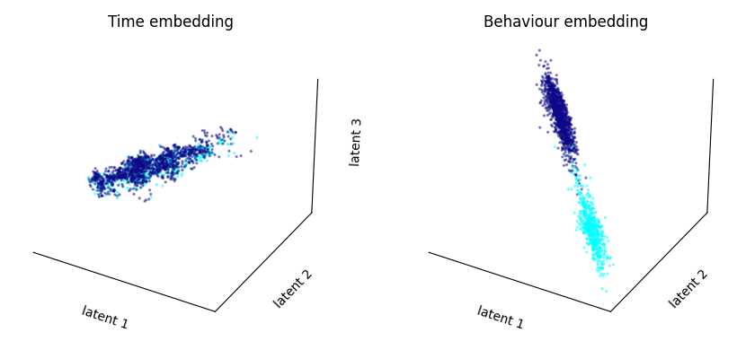
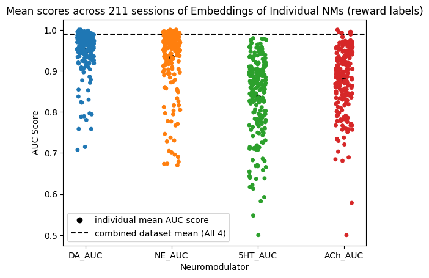
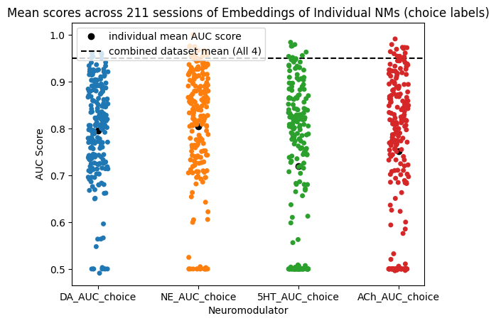
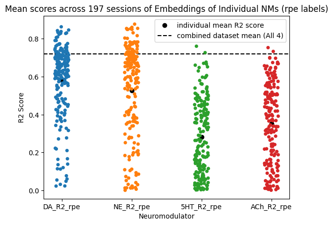

## Summary
This webpage summarizes the simultaneous analysis of 4 neuromodulators with CEBRA in a dynamic foraging task. The summary borrows heavily from the Jupyter notebook, [AIND-DATA](https://github.com/BrianNGitahi/CEBRA_Pack/blob/main/AIND-Data.ipynb), that shows a preliminary demo on how to use CEBRA with AIND data. It will cover the formatting of data from the Fiber Photometry pipeline of 4 Neuromodulators (DA, 5HT, ACh, NE) recorded in the Nucleus Accumbens region. It will also briefly describe the labels used with CEBRA and explain one set of embeddings. For a more hands-on intro to CEBRA, check out the [Basics notebook](https://github.com/BrianNGitahi/CEBRA_Pack/blob/main/Basics.ipynb) which provides a more general overview with some snippets from demos on the Mathis's lab webpage.(click [here](notebooks/Basics.ipynb) to download it)

## Formatting Data
In this foraging task, the mouse is given a binary choice, to lick right or left on each trial. Each choice the mouse makes is either rewarded or unrewarded. For this analysis, we want to view the neural data in a 1 second window around the choice time at each trial in the session. The hope is that this will make it easy to identify the presence/absence of reward in the neuromodulator signal.

In the preliminary analysis, we only considered trials where the mouse made a choice. For each of these trials, we found the timestamp of the dF/F signal that was closest in time to the time of the choice. We then used this temporal information to get the 10 preceding and subsequent dF/F signal values from the 'choice time'.

## Behaviour Labels
CEBRA has both supervised and unsupervised modes of learning the embedding space. In the supervised mode, also known as CEBRA-Behaviour, the user defines labels to be used to classify the input data. These labels can be continuous or discrete. In this analysis, we tested 3 different labels: reward labels, choice labels and RPE (reward prediction error) labels, where each trial was labelled as:
  - rewarded/unrewarded for the reward labels
  - left/right for the choice labels
  - a value in the range (-1,1) for the RPE labels

## Example Embedding

**Figure 1: CEBRA Embeddings showing separation of trials into rewarded (light blue) and unrewarded (purple) from one session**

From this pair of embeddings, we can see that there is a clustering of the rewarded (light blue) and unrewarded (purple) trials when we use CEBRA behaviour. The CEBRA-Time embedding is used as a control. CEBRA-Time embedding is constructed using the unsupervised mode and so the labels we defined earlier to group trials into rewarded and unrewarded are absent when using CEBRA-Time but present when using CEBRA-Behaviour.

## Summary Plot

We ran CEBRA on multiple sessions of the same data and generated a table documenting the quality of the embeddings and how well each of the neuromodulators captured the presence/absence of reward using the area under the ROC curve (AUC). A higher AUC score means the model can more accurately classify the trials based on the provided labels. We run the analysis in two different ways:
  - we ran it using the full dataset consisting of 4 neuromodulators: this produced the best auc score mean across all sessions
  - we also ran CEBRA using individual neuromodulators and the trend was that **dopamine (DA) and norepinephrine (NE) had higher AUC score means than serotonin (5HT) and acetylcholine (ACh) for the reward label**

**Figure 2: Figure showing the AUC scores for the embeddings produced from the Neuromodulator data and rewarded/unrewarded labels**

## Choice Label Analysis

We also ran CEBRA on the same data with two other label types. The first one we used was a choice label, i.e. wheter the mouse chose to lick left or right on a particular trial. For this, I define a left trial as a trial in which the mouse had more licks to the left and similarly for the right trial. For this behaviour label, we are also able to recover an accurate classification of the trials in a session into left/right trials as shown in this example embedding:

_figure here_

We also ran this analysis on multiple sessions and generated a summary plot like before:

In the case of choice labels, the performance of CEBRA in decoding the label from DA and NE is still better than in 5HT and ACh, but the difference is not as big as in the case of the reward labels.

## RPE Label Analysis

The last label we succesfully used was the RPE label. This label was different from the first two in that it is a continuous label rather than a discrete label, i.e. it can take a range of values in (-1,1) as opposed to the discrete, binary labels from before {0,1}. It follows that the reconstruction score used will be different. Here, we use the R^2^ score to quantify how well CEBRA decodes the labels in the embedding that it computes. The embeddings show a similar distinction between high RPE values and low RPE values, except in this case, there's a gradient in the colour that takes on continuous values as shown below (high RPE values are in the yellow region of the spectrum and low RPE values are in the purple region):

_figure here_

Again, we ran the analysis on multiple sessions and the summary plot is shown below:

