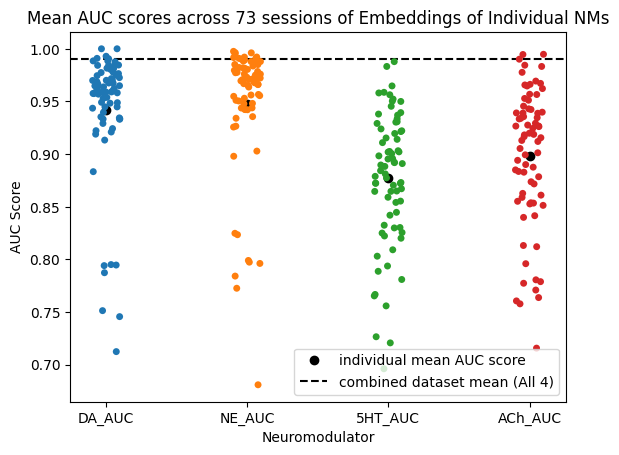

## Summary
This document summarizes the Jupyter notebook, AIND-DATA , that shows a preliminary demo on how to use CEBRA with AIND data. It will cover the formatting of data from the Fibre Photometry pipeline of 4 Neuromodulators (DA, 5HT, ACh, NE) recorded in the Nucleus Accumbens region. It will also briefly describe the labels used with CEBRA and explain one set of embeddings. For a more hands-on intro to CEBRA, check out the Basics notebook  which provides a more general overview with some snippets from demos on the Mathis's lab webpage.

## Formatting Data
In this foraging task, the mouse is given a binary choice, to lick right or left on each trial. Each choice the mouse makes is either rewarded or unrewarded. For this analysis, we want to view the neural data in a 1 second window around the choice time at each trial in the session. The hope is that this will make it easy to identify the presence/absence of reward in the neuromodulator signal.

In the preliminary analysis, we only considered trials where the mouse made a choice. For each of these trials, we found the timestamp of the dF/F signal that was closest in time to the time of the choice. We then used this temporal information to get the 10 preceding and subsequent dF/F signal values from the 'choice time'.

## Behaviour Labels
CEBRA has both supervised and unsupervised modes of learning the embedding space. In the supervised mode, also known as CEBRA-Behaviour, the user defines labels to be used to classify the input data. These labels can be continuous or discrete. In this analysis, each trial was labelled as rewarded/unrewarded.

## Example Embedding

**Figure 1: CEBRA Embeddings showing separation of trials into rewarded (light blue) and unrewarded (purple) from one session**

From this pair of embeddings, we can see that there is a clustering of the rewarded (light blue) and unrewarded (purple) trials when we use CEBRA behaviour. The CEBRA-Time embedding is used as a control here. CEBRA-Time embedding is constructed using the unsupervised mode and so the labels we defined earlier to group trials into rewarded and unrewarded were absent in this case.

## Summary Plot

We ran CEBRA on multiple sessions of the same data and generated a table documenting the quality of the embeddings and how well each of the neuromodulators captured the presence/absence of reward.

**Figure 2: Figure showing the AUC scores for the embeddings produced from the Neuromodulator data and rewarded/unrewarded labels**

## Next Steps
A possible next step is to try this on all trials and include a third label, `no choice`, and see how well CEBRA can separate all three. We would also like to define and use other behavioural labels that we think are directly related to the recordings of the NMs in this task. This example only shows CEBRA using discrete labels, so one of the next examples will aim to show CEBRA using continuous labels. This particular embedding also doesn't show the relative contribution of each Neuromodulator to the separation of trials based on reward.
